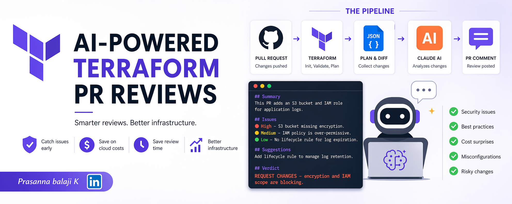
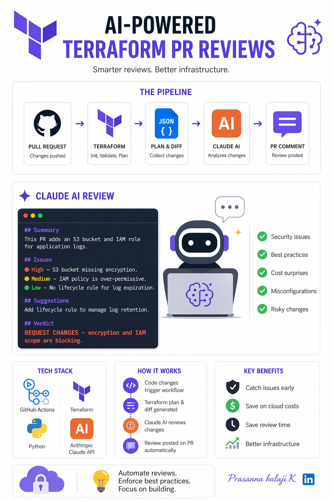

<p align="center">
  
</p>

# How I Built an AI-Powered Terraform Review Pipeline with GitHub Actions and Claude

> Every PR that touches infrastructure deserves a second pair of eyes — I made Claude that second pair.

---

## The Problem

Our team was merging Terraform PRs too fast. Not recklessly — we had peer reviews, `terraform plan` outputs, and Checkov scans. But reviewers were still missing things: over-permissive IAM roles, missing tags, non-idiomatic module usage, drift-prone resource names.

The issues weren't bugs. They were judgment calls — exactly the kind of thing that's hard to catch in a rules-based linter but easy to spot if you know what you're looking for.

I wanted something that could read a Terraform diff and say: *"This S3 bucket has no versioning, and this IAM role allows `*` on all actions — you probably want to tighten that."*

So I built it.

---

## The Architecture

```
PR opened / updated
       │
       ▼
GitHub Actions Workflow
       │
       ├── terraform fmt --check
       ├── terraform validate
       ├── terraform plan (saved as JSON)
       │
       └── Claude Review Step
               │
               ├── Reads: git diff (*.tf files)
               ├── Reads: terraform plan JSON
               └── Posts: structured review comment on the PR
```

<p align="center">
  
  <br/>
  <em>Pipeline flow — from PR trigger to Claude review comment</em>
</p>

Three stages. The first two are standard hygiene. The third is where Claude comes in.

---

## Step 1: Capture the Diff and Plan

In the workflow, after `terraform plan`, I export the plan as JSON and capture the `.tf` file diff:

```yaml
- name: Terraform Plan
  id: plan
  run: |
    terraform plan -out=tfplan
    terraform show -json tfplan > tfplan.json

- name: Get Terraform Diff
  id: diff
  run: |
    git diff origin/main...HEAD -- '*.tf' > tf_diff.txt
```

Both files feed into the review step.

---

## Step 2: Call Claude via the Anthropic API

I wrote a small Python script (`review.py`) that the workflow calls. It reads the diff and plan, builds a structured prompt, and calls the Claude API.

```python
import anthropic
import sys

def review_terraform(diff: str, plan: str) -> str:
    client = anthropic.Anthropic()

    system_prompt = """You are a senior cloud engineer reviewing Terraform infrastructure changes.
Your job is to catch issues that automated linters miss: security risks, cost surprises,
missing best practices, and unclear intent. Be concise, precise, and actionable.
Format your output as:

## Summary
One paragraph overview of what this PR changes.

## Issues
List only real issues. For each: severity (High/Medium/Low), what it is, why it matters, and how to fix it.

## Suggestions
Optional improvements that aren't blocking.

## Verdict
APPROVE / REQUEST CHANGES — one line with a reason."""

    user_message = f"""Review this Terraform PR.

### Git Diff (*.tf files)
```hcl
{diff[:6000]}
```

### Terraform Plan (JSON summary)
```json
{plan[:4000]}
```"""

    message = client.messages.create(
        model="claude-opus-4-5",
        max_tokens=1500,
        system=system_prompt,
        messages=[{"role": "user", "content": user_message}]
    )

    return message.content[0].text

if __name__ == "__main__":
    with open("tf_diff.txt") as f:
        diff = f.read()
    with open("tfplan.json") as f:
        plan = f.read()

    review = review_terraform(diff, plan)
    print(review)

    with open("review_output.txt", "w") as f:
        f.write(review)
```

Key design choices:
- **System prompt sets the role clearly.** Claude behaves differently when told it's a senior engineer doing a real review vs. a general assistant.
- **Output is structured.** The fixed format (Summary → Issues → Suggestions → Verdict) makes PR comments readable and consistent.
- **Token budgets are explicit.** I cap the diff at 6K chars and plan at 4K to stay well within context limits. For large PRs, I trim to changed resource blocks only.

---

## Step 3: Post the Review as a PR Comment

```yaml
- name: Run Claude Review
  env:
    ANTHROPIC_API_KEY: ${{ secrets.ANTHROPIC_API_KEY }}
  run: python review.py

- name: Post Review Comment
  uses: actions/github-script@v7
  with:
    script: |
      const fs = require('fs');
      const review = fs.readFileSync('review_output.txt', 'utf8');

      await github.rest.issues.createComment({
        owner: context.repo.owner,
        repo: context.repo.repo,
        issue_number: context.issue.number,
        body: `## 🤖 AI Terraform Review\n\n${review}\n\n---\n*Reviewed by Claude via Anthropic API*`
      });
```

The comment appears on the PR within ~30 seconds of a push.

---

## The Full Workflow File

```yaml
name: Terraform Review

on:
  pull_request:
    paths:
      - '**.tf'
      - '**.tfvars'

jobs:
  review:
    runs-on: ubuntu-latest
    permissions:
      pull-requests: write
      contents: read

    steps:
      - uses: actions/checkout@v4
        with:
          fetch-depth: 0

      - uses: hashicorp/setup-terraform@v3
        with:
          terraform_version: "1.10.x"

      - name: Terraform Init
        run: terraform init
        env:
          AWS_ACCESS_KEY_ID: ${{ secrets.AWS_ACCESS_KEY_ID }}
          AWS_SECRET_ACCESS_KEY: ${{ secrets.AWS_SECRET_ACCESS_KEY }}

      - name: Terraform Format Check
        run: terraform fmt -check -recursive

      - name: Terraform Validate
        run: terraform validate

      - name: Terraform Plan
        run: |
          terraform plan -out=tfplan
          terraform show -json tfplan > tfplan.json

      - name: Get Terraform Diff
        run: git diff origin/main...HEAD -- '*.tf' > tf_diff.txt

      - name: Set up Python
        uses: actions/setup-python@v5
        with:
          python-version: "3.12"

      - name: Install Dependencies
        run: pip install anthropic

      - name: Run Claude Review
        env:
          ANTHROPIC_API_KEY: ${{ secrets.ANTHROPIC_API_KEY }}
        run: python .github/scripts/review.py

      - name: Post Review Comment
        uses: actions/github-script@v7
        with:
          script: |
            const fs = require('fs');
            const review = fs.readFileSync('review_output.txt', 'utf8');
            await github.rest.issues.createComment({
              owner: context.repo.owner,
              repo: context.repo.repo,
              issue_number: context.issue.number,
              body: `## 🤖 AI Terraform Review\n\n${review}\n\n---\n*Reviewed by Claude via Anthropic API*`
            });
```

---

## A Real Example

Here's the kind of comment the pipeline produced on a recent PR:

> **## Summary**
> This PR provisions a new S3 bucket for application logs and attaches an IAM role for EC2 access.
>
> **## Issues**
> - **High** — `aws_s3_bucket` has no `server_side_encryption_configuration`. Log buckets often contain sensitive data; enable SSE-S3 or SSE-KMS.
> - **Medium** — IAM policy uses `"Action": "s3:*"`. Scope this down to `s3:PutObject` and `s3:GetObject` only.
> - **Low** — No `lifecycle_rule` defined. Log buckets grow indefinitely; add an expiration rule.
>
> **## Suggestions**
> - Add `force_destroy = false` explicitly to avoid accidental deletion.
>
> **## Verdict**
> REQUEST CHANGES — encryption and IAM scope are blocking.

That's a review I'd be happy to get from a human. The engineer fixed all three issues before the PR was merged.

---

## What It Catches Well

- Over-permissive IAM policies
- Missing encryption, versioning, or lifecycle rules on storage resources
- Resources without required tags
- Security group rules open to `0.0.0.0/0`
- Suspicious `destroy` operations in the plan
- Non-idiomatic or inconsistent naming

## What It Doesn't Replace

- **`terraform plan` review by a human** for production changes
- **Checkov / tfsec** for deterministic policy enforcement
- **Cost estimation** (use Infracost for that)
- Domain-specific context that only your team has

Claude catches judgment calls. It doesn't replace the full review process — it makes it faster and more thorough.

---

## Cost

At current API pricing, each review costs roughly **$0.01–$0.04** depending on diff size. For a team running 50 Terraform PRs a month, that's under $2/month. Cheaper than one missed security misconfiguration.

---

## What's Next

- **Summarize plan cost delta** using Infracost JSON output as additional context
- **Thread comments** on specific lines of the diff rather than a top-level PR comment
- **Block merge** if Claude returns `REQUEST CHANGES` with a High severity issue (still evaluating this — noisy CI is its own problem)

---

## Wrapping Up

The pipeline took about half a day to build and has been running in production for three months. It's caught real issues on real PRs. More importantly, it's raised the baseline quality of Terraform reviews — engineers write better code knowing it'll be reviewed consistently.

If you're already running GitHub Actions for Terraform, adding this is low effort and high value. The hardest part is writing a good system prompt. Start there.

---

*Have questions or want to share how you've extended this? Drop a comment below.*
